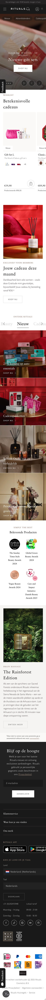
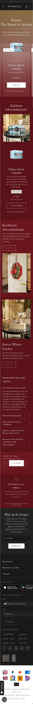
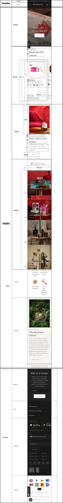
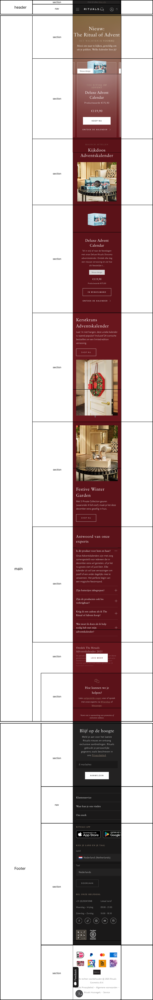

# Procesverslag
Markdown is een simpele manier om HTML te schrijven.  
Markdown cheat cheet: [Hulp bij het schrijven van Markdown](https://github.com/adam-p/markdown-here/wiki/Markdown-Cheatsheet).

Nb. De standaardstructuur en de spartaanse opmaak van de README.md zijn helemaal prima. Het gaat om de inhoud van je procesverslag. Besteedt de tijd voor pracht en praal aan je website.

Nb. Door *open* toe te voegen aan een *details* element kun je deze standaard open zetten. Fijn om dat steeds voor de relevante stuk(ken) te doen.

## Jij

  
uitwerken voor kick-off werkgroep

  ### Auteur:
  Noëlle Bijl

  #### Je startniveau:
  Blauw

  #### Je focus:
  Responsive
 

## Je website

  
uitwerken voor kick-off werkgroep

  ### Je opdracht:
  https://www.rituals.com/nl-nl/home

  #### Screenshot(s) van de eerste pagina (small screen): 
  Rituals Home
  

  #### Screenshot(s) van de tweede pagina (small screen):
  Rituals Advent 
  
 

## Toegankelijkheidstest 1/2 (week 1)

  
uitwerken na test in 2e werkgroep

  ### Bevindingen
  Lijst met je bevindingen die in de test naar voren kwamen:

- Rituals gebruikt niet vaak headings. Soms gebruiken ze alleen een h3 of niets. Ik vind het niet altijd duidelijk wat wat is, ze begruiken dan bijvoorbeeld een span in plaats van een h.

- Rituals maakt veel gebruik van div. Ze gebruiken vaak een div in een div in een div, etc. Dit is erg onduidelijk en ze gebruiken hierdoor ook heel erg veel onnodige classes

- Tijdens het testen met de screenreader merkte ik dat sommige afbeeldingen werden overgeslagen, dus ze werden niet verteld. De meeste img in de code hebben een wel alt tekst, maar de alt teksten waren wel lastig te vinden omdat er erg veel andere teksten bij stonden. 

- Er is geen dark mode of high-contrast modus beschikbaar. Dit zou de toegankelijkheid van de website nog meer omhoog kunnen krijgen.

- Tijdens de sreecreader test kwam ik erachter dat de volgorde van de code niet helemaal klopt. Je krijgt soms eerst een img op p te horen en daarna de h2. Om het toegankelijk te maken moet dit in de juiste volgorde staan.

- De website was tijdens het gebruik van de voice over volledig te bedienen met het toetsenbord, dus zonder muis. Voor de mensen die geen muis hebben is dit een fijne en belangrijke toevoeging

- De contrast ratio is over het algemeen goed op de rituals website. Wel zijn er een paar plekken Waar de contrast ratio slecht scoort. Bijvoorbeeld op de advent pagina, bij de li en dan de a ontdek rituals. 

- Via inspecteren en dan Rendering kon ik de website testen voor mensen met kleurenblindheid. Als eerst heb ik Reducted contrast uitgeprobeerd. Hieruit kwam dat het bij de buttons niet meer duidelijk was dat het een button was, omdat de uitlijning van de button erg dun is en verder wordt de button bijvoorbeeld door kleur niet onderscheden.

## Breakdownschets (week 1)

  
uitwerken na afloop 3e werkgroep

  ### de hele pagina: 
  

  ### dynamisch deel (bijv menu): 
  

## Voortgang 1 (week 2)

  
uitwerken voor 1e voortgang

  ### Verslag van meeting

- Gebruik in de html minder classes. Gebruik in plaats hiervan p:first-of-type etc. 

- Niet elke section moet een h1 hebben. Maak in de main een h1 aan en maak de h1 verborgen. Doe dit door middel van de link die in teams is gestuurd.

- De screenshots van de website moeten op telefoonformaat in het bestand gezet worden. En helemaal van de volledige pagina

- Doe de toegankelijkheids test, en schrijf het uitgebreid uit

## Voortgang 2 (week 3)

  
uitwerken voor 2e voortgang

  ### Stand van zaken
  In de html code heb ik de meeste classes verwijderd en gebruik gemaakt van p:first-of-type en p:last-of-type

  ### Verslag van meeting

  - Schrijf de toegankelijkheids test uitgebreider uit

  - De breakdownschets moet verder worden uitgebreid. Laat ook zien waar je een ul, li, p, etc. gebruikt
  
  - De section ontdek rituals is een lastig gedeelte, maak eerst de rest van de website en als ik klaar ben kan ik proberen dit stuk te maken

## Toegankelijkheidstest 2/2 (week 4)

  
uitwerken na test in 9e werkgroep

  ### Bevindingen
  - Mijn website heeft nu een darkmodus, dit had de echte website niet. Ik denk dat dit een goede toevoeging is voor de toegankelijkheid.
  
  - Alle sections hebben duidelijke en toepasselijke namen.
  
  - Alle afbeeldingen hebben duidelijke en logische alts.
  
  - Ik heb een hidden h1 toegevoegd met de paginatitel in de code zodat deze worden voorgelezen op de screenreader maar niet zichtbaar is. Hierdoor kunnen mensen die gebruik maken van de screenreader beter volgen waar zij zich bevinden.
  
  - Ik heb HTML-elementen gebruikt zoals: section, article, nav, etc. voor acties. Hierdoor begrijpen screenreaders beter wat de inhoud is.
  
  - Ik heb de HTML zo opgebouwd dat de leesvolgorde klopt, hierdoor is het makkelijker te lezen voor screenreaders. Ik heb de visuele volgorde veranderd via order in mijn css

  - Ik heb ook goed naar het contrast en leesbaarheid gekeken en toegepast in mijn website. Ik heb dit ook getest via inspecteren > rendering en dan de deficiences dropdown. Via daar kon ik mijn website bekijken als iemand bijvoorbeeld kleurenblind is. 

## Voortgang 3 (week 4)

  
uitwerken voor 3e voortgang

  ### Stand van zaken
  De home pagina ziet er al goed uit. Het responsive maken vidn ik bij sommige gedeeltes wel lastig maar het gaat steeds beter. Ik moet nog wel de hele advent pagina, dus ik moet nog wel veel doen.

  ### Verslag van meeting
  hier na afloop snel de uitkomsten van de meeting vastleggen

  - Om de afbeeldingen goed responsive te maken moet je op w3schools de uileg goed volgen. Door de width en height goed vast te stellen. 
  - Via de webiste van rituals kan je de fonts downloaden en in je code zetten. Hierdoor gaat het website er steeds meer hetzelfde uitzien. 
  - light dark mode - presentatie 1
  - summary details, open en dicht klap in html
  - toegankelijksheistest uitbreiden 2  (en misschien de eerste ook nog een beetje (lees handlijding screenreader))
  - vertel wat je lastig vond en goed vond gaan (aria hidden)

## Eindgesprek (week 5)

  
uitwerken voor eindgesprek

  ### Dit ging goed/Heb ik geleerd: 
  Tijdens deze opdracht heb ik veel geleerd over het responsive maken van een website. Ik begrijp nu goed hoe en waar je flex en grid moet gebruiken en hoe je het met de media query responsive kunt maken. Verder heb ik ook nieuwe theorie opgedaan, zoals hoe je makkelijk 
 en 
 en dropdownlist kan maken, en heb ik ontdekt hoe ik slimmer en efficiënter kan werken met CSS. Ik ben tevreden met het eindresultaat en dat hij responsive goed werkt. 

  ### Dit was lastig/Is niet gelukt:
  Een uitdaging voor mij was dat ik tijd tekort kwam. Ik vond sommige gedeeltes best lastig om te maken, waardoor ik het minder leuk vond en ik ze ging uitstellen. Wat ik nog wel zou willen leren, wat ik nu lastig vind is het werken met aria-hidden. Ik weet nog niet precies hoe dat werkt. Daarnaast vond ik het hamburger menu ook moeilijk om te maken. Voornamelijk om het hamburger menu responsive te maken. Het is mijn ook niet helemaal gelukt om het hamburgermenu hetzelfde te maken, maar hij werkt wel, en het ziet er mooi uit dus daar ben ik blij mee.

## Bronnenlijst

  
continu bijhouden terwijl je werkt

  1. bron 1: https://www.a11yproject.com/posts/how-to-hide-content/ - 
  2. bron 2: https://cssgradient.io/
  3. bron 3: week 5: Dé JS 3-stap oefening 2 - Hamburger menu
  4. bron 4: ChatGPT 

